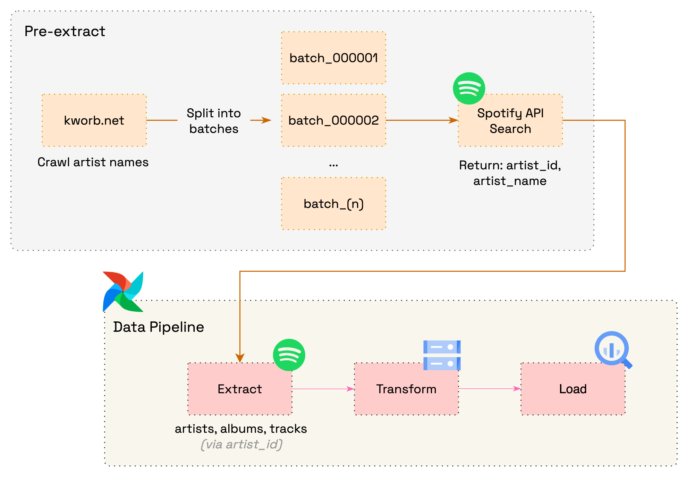

# 🎶 Spotify Data Pipeline
This project builds an ETL pipeline that collects data from the Spotify WebAPI, transforms it into a structured format, and stores it on Google Cloud for analytical purposes. The workflow is orchestrated with Apache Airflow and utilizes Google Cloud Storage (GCS) and BigQuery.

**Note:** This project is in progress and will be continuously updated.



## Repository Structure
```txt
spotify
├── airflow/                            *  Airflow project (DAGs, configs, plugins, logs)
│   ├── config/                         
│   ├── dags/                           
│   │   └── spotify_etl.py              
│   ├── logs/                           *  (gitignored)
│   ├── plugins/                        
│   └── utils/                          
├── data/                               *  Local data
├── images/                             
├── scripts/                            *  Scripts for setup & ETL
│   ├── create_artist_batches.py        
│   ├── create_bucket.py                
│   └── search_artist_id_and_name.py    
├── .gitignore                          
├── docker-compose.yaml                 
├── Dockerfile                          
├── README.md                           
└── requirements.txt                    
```